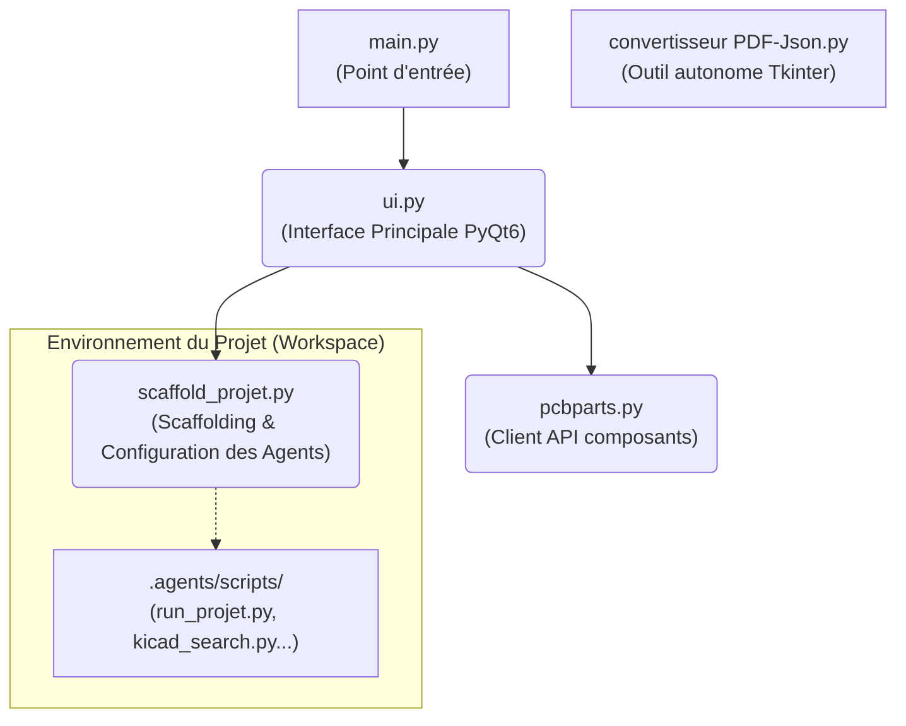

# Manuel Utilisateur - L'Atelier

## 1. Démarrage de l'Application
Lancez l'application via la commande :
```bash
python main.py
```
Au lancement, une boîte de dialogue s'ouvre pour vous permettre de :
- Créer ou ouvrir un projet **Code**.
- Créer ou ouvrir un projet **Hardware** (Carte électronique).
- Créer ou ouvrir un projet **Mécanique** (Pièce 3D).

Une option permet également d'installer ou de mettre à jour le kit d'agents Antigravity dans le dossier de votre projet. Cochez cette case pour que L'Atelier prépare automatiquement le terrain pour les agents IA.

## 2. Interface Principale
L'interface de L'Atelier est divisée en plusieurs panneaux :
- **Panneau de gauche (Onglets)** :
  - **Fichiers** : Explorateur de fichiers du projet (pour naviguer, renommer, supprimer).
  - **Éditeur** : Éditeur de texte intégré avec coloration syntaxique basique pour le Python.
  - **Journal** : Console affichant les logs et les retours de l'environnement (et potentiellement des agents).
- **Panneau de droite** : Panneau spécifique au mode choisi (Coder, Hardware, ou Mécanique). Permet de lancer les actions spécifiques, d'importer des fichiers (comme les datasheets pour l'électronique), d'exécuter Graphify, etc.

## 3. Interaction avec les Agents
Les agents (via l'intégration Antigravity) analysent votre projet et peuvent y apporter des modifications de manière sécurisée.
- Ils travaillent dans un dossier `.agents/` ajouté à votre projet lors de la préparation (scaffolding).
- Vos fichiers sont sauvegardés dans le dossier `.agent_backups/` avant toute modification automatique par un agent ou l'interface. Les 20 dernières versions de chaque fichier sont conservées.

## 4. Architecture de l'Application

Voici une vue d'ensemble de la manière dont les différents scripts Python interagissent au sein du projet L'Atelier :



## 5. Outils Auxiliaires

### Convertisseur PDF vers JSON
Un outil est fourni pour extraire le texte (en Markdown) et les images des fiches techniques (datasheets) au format PDF, pour que les agents puissent les lire facilement.
- **Lancement** : `python "convertisseur PDF-Json.py"`
- **Utilisation** :
  1. Sélectionnez les fichiers PDF sources.
  2. Sélectionnez le dossier de destination (généralement la racine de votre projet, l'outil créera ou utilisera le dossier `data_sheets`).
  3. Cliquez sur "Lancer la conversion".

### Intégration KiCad / SKiDL (Mode Hardware)
Si vous travaillez sur une carte électronique, assurez-vous de renseigner les chemins vers vos bibliothèques KiCad lorsqu'on vous le demande. L'Atelier enregistre ces chemins pour que les scripts SKiDL générés puissent s'exécuter correctement.

### Exécution Isolé (Sandbox & Docker)
Lorsque L'Atelier exécute des scripts (par exemple ceux générés par les agents), il tentera de le faire via **Docker** dans un conteneur éphémère (`python:3.10-slim`) si Docker est installé et en cours d'exécution, afin de protéger votre machine. Sinon, il exécutera le code localement dans un environnement de sous-processus restreint.
