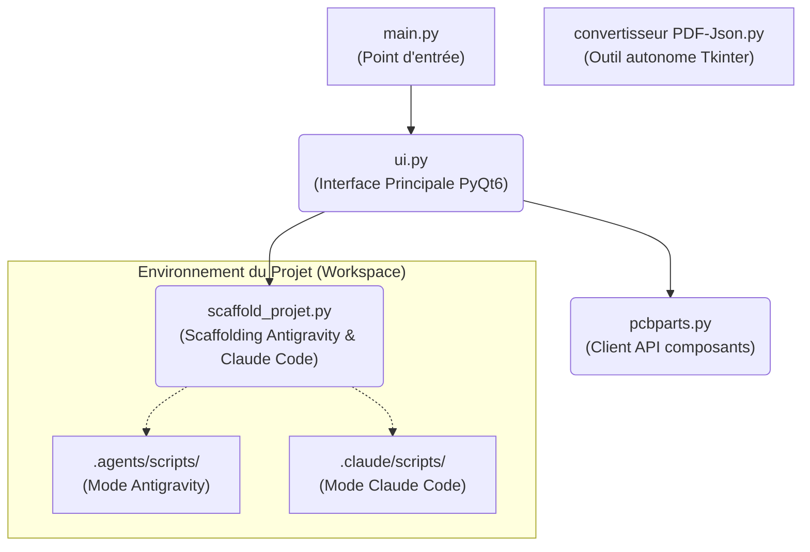

# Manuel Utilisateur - L'Atelier

## 1. Démarrage de l'Application
Lancez l'application via la commande :
```bash
python main.py
```
Au lancement, une boîte de dialogue s'ouvre pour vous permettre de :
1. **Choisir le Domaine et l'Action** :
   - Créer ou modifier un projet **Code** (Logiciel Python).
   - Créer ou modifier un projet **Hardware** (Carte électronique KiCad / SKiDL).
   - Créer ou modifier un projet **Mécanique** (Pièce 3D CadQuery).
2. **Choisir l'Outil IA Cible** :
   - **Antigravity (Gemini)** : Installe le dossier `.agents/` et le contrat `AGENTS.md`.
   - **Claude Code (Claude)** : Installe le dossier `.claude/`, le contrat `CLAUDE.md`, `AGENTS.md` et les commandes slash (`.claude/commands/`).
3. **Préparation automatique (Scaffolding)** :
   Une case à cocher permet d'installer ou de mettre à jour le kit d'agents adapté dans votre projet. L'Atelier élague automatiquement les familles d'agents inutiles, prépare les dossiers (`.agent_reports/`, `data_sheets/`, etc.), écrit le cache d'environnement et configure les garde-fous.

## 2. Interface Principale
L'interface de L'Atelier est divisée en plusieurs panneaux :
- **Panneau de gauche (Onglets)** :
  - **Fichiers** : Explorateur de fichiers du projet (pour naviguer, renommer, supprimer).
  - **Éditeur** : Éditeur de texte intégré avec coloration syntaxique pour le Python.
  - **Journal** : Console affichant les logs et les retours de l'environnement (et des agents).
- **Panneau de droite** : Panneau spécifique au mode choisi (Coder, Hardware, ou Mécanique). Permet de lancer les actions spécifiques, d'importer des fichiers (comme les datasheets pour l'électronique), d'exécuter Graphify, etc.

## 3. Interaction avec les Agents
Les agents analysent votre projet et y apportent des modifications de manière sécurisée.
- **Pour Antigravity** : Ils travaillent dans le dossier `.agents/` et se coordonnent via `.agent_reports/`.
- **Pour Claude Code** : Ils utilisent le dossier `.claude/`, le fichier `CLAUDE.md` et les commandes slash (`/code-feature`, `/hw-carte`, `/meca-piece`, etc.).
- **Règle Multi-Fichiers (> 2 fichiers)** : Dès qu'une modification requiert plus de 2 fichiers (dès 3 fichiers), les kits d'agents imposent le découpage séquentiel en passes ciblées (Option B). L'Architecte sépare le travail en passes ordonnées, l'Orchestrateur pilote un agent d'écriture par passe avec un contexte épuré et contrôle la création sur disque, puis le Reviewer valide le tout.
- Vos fichiers sont sauvegardés dans le dossier `.agent_backups/` avant toute modification automatique par un agent ou l'interface. Les 20 dernières versions de chaque fichier sont conservées.


## 4. Architecture de l'Application

Voici une vue d'ensemble de l'interaction entre les composants :



## 5. Outils Auxiliaires

### Convertisseur PDF vers JSON
Un outil est fourni pour extraire le texte (en Markdown) et les images des fiches techniques (datasheets) au format PDF, pour que les agents puissent les lire facilement.
- **Lancement** : `python "convertisseur PDF-Json.py"`
- **Utilisation** :
  1. Sélectionnez les fichiers PDF sources.
  2. Sélectionnez le dossier de destination (généralement la racine de votre projet, l'outil créera ou utilisera le dossier `data_sheets`).
  3. Cliquez sur "Lancer la conversion".

### Intégration KiCad / SKiDL (Mode Hardware)
Si vous travaillez sur une carte électronique, assurez-vous de renseigner les chemins vers vos bibliothèques KiCad lorsqu'on vous le demande. L'Atelier enregistre ces chemins dans `.agents/cache/env.json` ou `.claude/cache/env.json` pour que les scripts SKiDL puissent s'exécuter correctement.

### Exécution Isolée (Sandbox & Docker)
Lorsque L'Atelier exécute des scripts (par exemple ceux générés par les agents), il tentera de le faire via **Docker** dans un conteneur éphémère (`python:3.10-slim`) si Docker est installé et en cours d'exécution. Sinon, il exécutera le code localement dans un environnement de sous-processus restreint.
